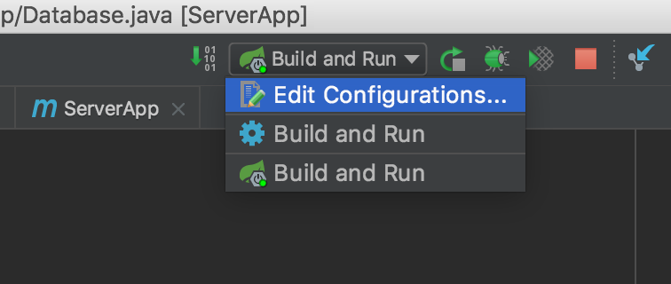
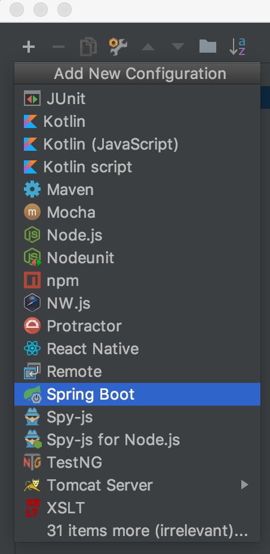
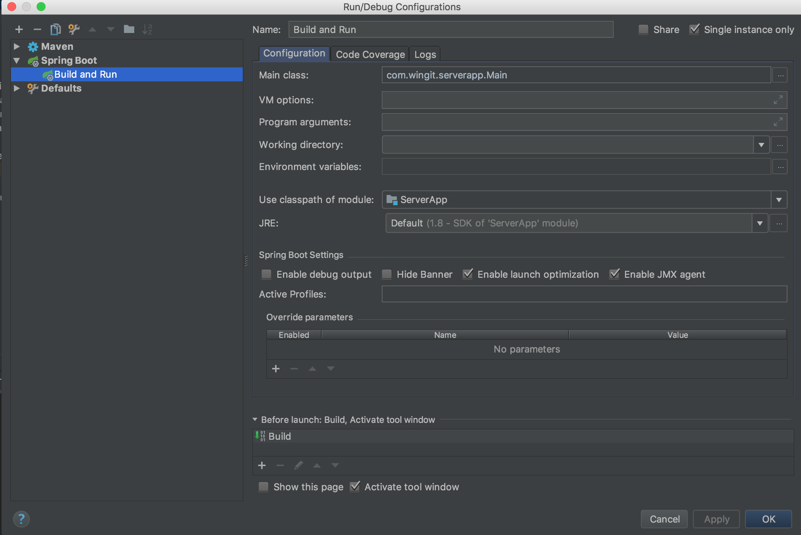
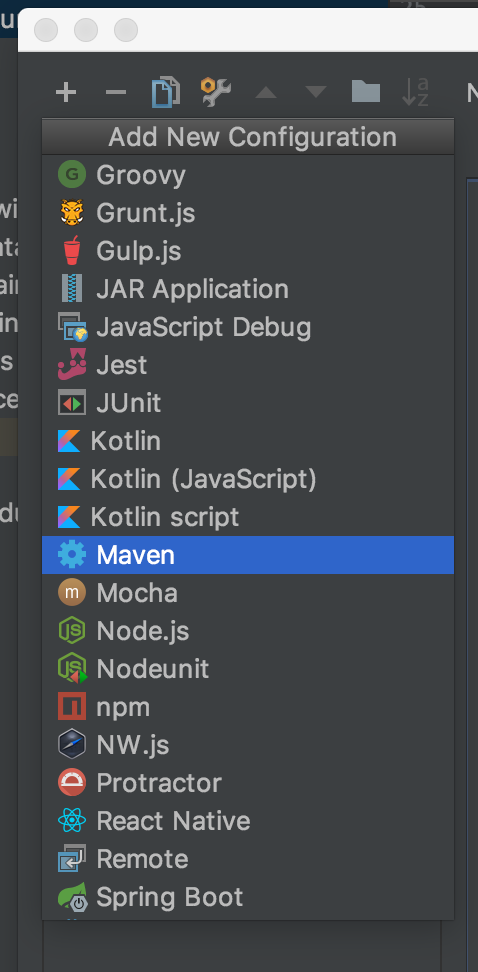
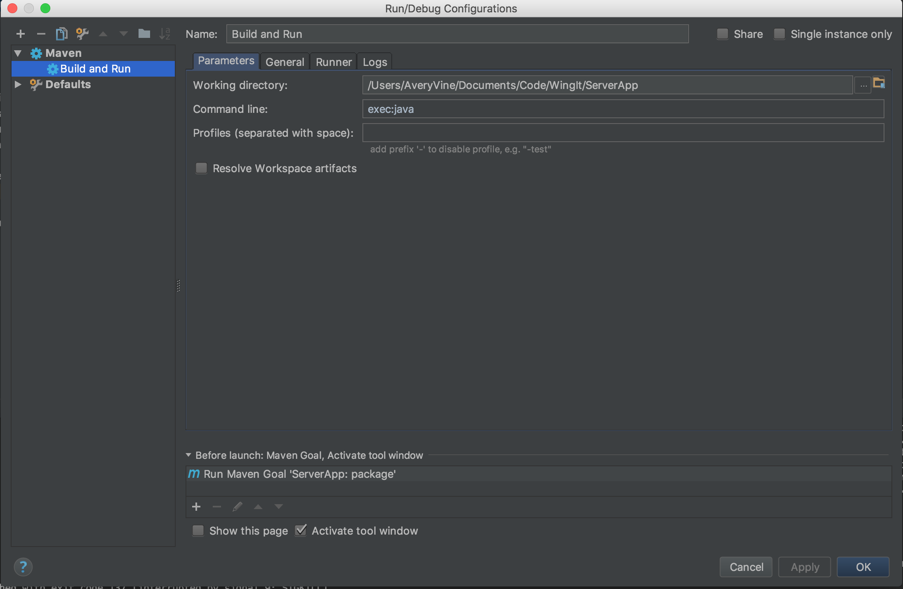

# <!-- omit in toc --> Analysis Server - Documentation

- [Project Setup](#project-setup)
- [Running in IntelliJ](#running-in-intellij)
    - [Running with Spring Boot](#running-with-spring-boot)
    - [Running with Maven](#running-with-maven)

# Project Setup

Note: these instructions are for macOS.
1. Navigate to your WingIt project folder
2. Clone the repository from here: https://github.com/WingItOttawa/AnalysisServer.git
3. (Optional but recommended) Set up Run Configurations in your favourite IDE (see [Running in IntelliJ](#running-in-intellij) for an example)

# Running in IntelliJ

There are two methods that can be used to run this application. We can rely on [Spring Boot](#running-with-spring-boot) to do the job and only use Maven for dependency management, or we can boot using [Maven](#running-with-maven). Either option works, but booting with Spring Boot is much faster and cleaner in the logs. Prefer this option over building and running with Maven.

In both cases, once Run Configurations are set up, you can click the green `Run` triangle in the top right of IntelliJ to run the server.

## Running with Spring Boot

1. Click on `Edit Configurations` in the top right 
2. Add a new Spring Boot configuration in the top left of the new window by clicking the `+` sign 
3. Fill in the `Name` and the `Main class` fields as shown 

## Running with Maven

1. Click on `Edit Configurations` in the top right 
2. Add a new Maven configuration in the top left of the new window by clicking the `+` sign 
3. Fill in the `Name` and the `Command line` fields as shown, then click the `+` sign under the `Before launch:` section at the bottom 
4. Select `Run Maven Goal` in the new window 
5. Fill in the `Command line` field as shown in this image 