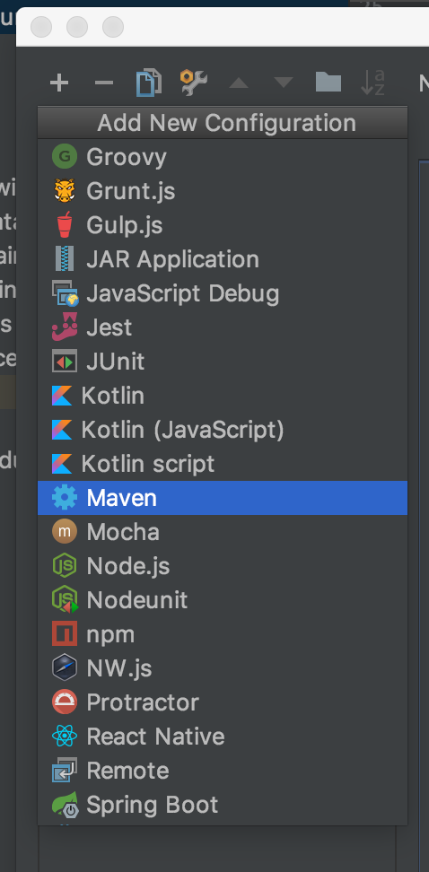
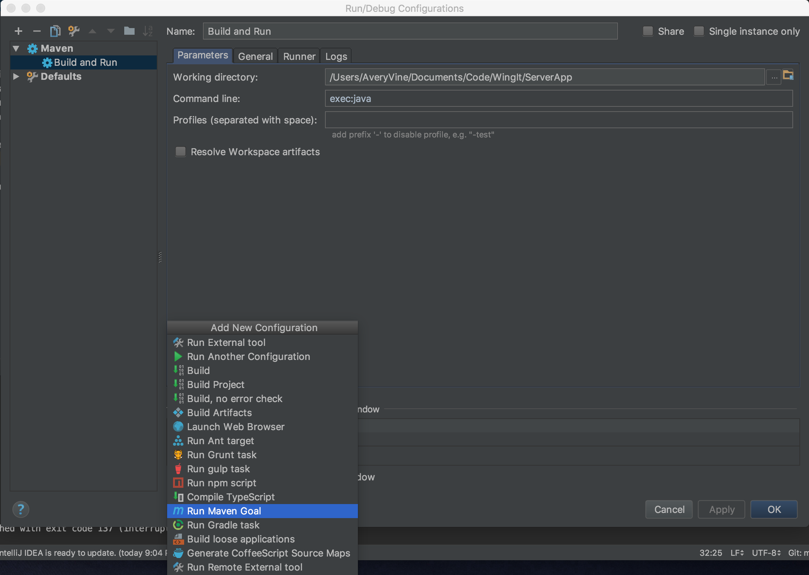
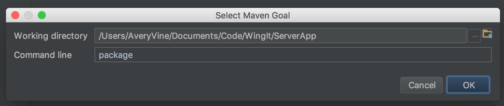

# <!-- omit in toc --> Analysis Server - Documentation

- [Project Setup](#project-setup)
- [Running Configurations in IntelliJ](#running-configurations-in-intellij)
        - [First Time Only](#first-time-only)
        - [Every Time](#every-time)

# Project Setup

Note: these instructions are for macOS.
1. Navigate to your WingIt project folder
2. Clone the repository from here: https://github.com/WingItOttawa/ServerApp
3. (Optional but recommended) Set up Run Configurations in your favourite IDE (see [Running in IntelliJ](#running-in-intellij) for an example)

# Running Configurations in IntelliJ

We are using Maven to manage dependencies and to run this application. We use two commands when building and running: `mvn package` to compile and package the content into a `.jar` file, and `mvn exec:java` to execute the newly packaged `.jar` file. The instructions below show how to set up a quick and easy run configuration so you don't have to type those commands into the command line each time you want to run the server.

### First Time Only
1. Click on `Edit Configurations` in the top right 
2. Add a new Maven configuration in the top left of the new window by clicking the `+` sign 
3. Fill in the `Name` and the `Command line` fields as shown in this image, then click the `+` sign under the `Before launch:` section 
4. Select `Run Maven Goal` in the new window 
5. Fill in the `Command line` field as shown in this image 

### Every Time
1. Click the green `Run` triangle in the top right of IntelliJ!